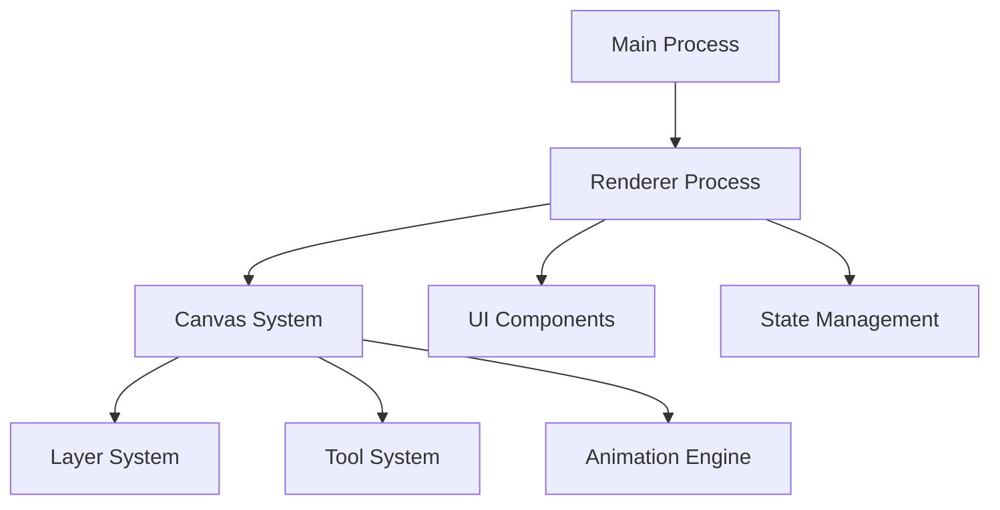

# Component Architecture

## Overview

This document provides a detailed breakdown of WASRTK's component architecture. For high-level architecture information, see [Architecture Overview](./overview.md).

## Component Interaction Diagram



## Main Process Components

### Window Management Component
**Location**: `main.js` - `createWindow()` function
**Responsibilities**:
- Electron browser window creation and configuration
- Window size and position management

### IPC Handler Component
**Location**: `main.js` - IPC event handlers
**Responsibilities**:
- File system operations (save, load, export)
- Binary file reading for image loading
- Screen capture functionality

## Renderer Process Components

### WASRTK Main Class
**Location**: `renderer.js` - `WASRTK` class
**Responsibilities**:
- Application initialization and lifecycle
- Component coordination
- Event system management

## Canvas System Components

### Main Canvas Component
**Purpose**: Primary drawing surface for composite rendering
**Properties**:
- `mainCanvas`: HTML5 Canvas element (256x256 default)
- `mainCtx`: 2D rendering context
- Background: White (#ffffff)

### Layer Canvas Components
**Purpose**: Individual layer drawing surfaces
**Structure**:
```javascript
const layer = {
    id: number,
    name: string,
    visible: boolean,
    locked: boolean,
    canvas: HTMLCanvasElement,
    ctx: CanvasRenderingContext2D
}
```

### Overlay Canvas Component
**Purpose**: Temporary drawing previews
**Properties**:
- `overlayCanvas`: HTML5 Canvas element
- `overlayCtx`: 2D rendering context
- Used for: Shape previews, brush previews

## Tool System Components

### Tool Selection Component
**Purpose**: Manages active drawing tool
**Properties**:
- `currentTool`: Active tool identifier
- Supported tools: pen, line, rectangle, circle, fill, eraser

### Brush Component
**Purpose**: Manages brush properties
**Properties**:
- `brushSize`: Brush size in pixels (1-50)
- `currentColor`: Active color (hex format)
- `currentOpacity`: Opacity level (0.0-1.0)
- `fillTolerance`: Flood fill tolerance (0-255)

### Drawing Tool Components

#### Pen Tool Component
**Purpose**: Freehand drawing with brush settings
**Key Operations**:
```javascript
drawPoint(x, y, useStrokeCtx = false) {
    const ctx = useStrokeCtx ? strokeCtx : frame.layers[currentLayer].ctx;
    ctx.fillStyle = currentColor;
    ctx.globalAlpha = currentOpacity;
    ctx.fillRect(x, y, brushSize, brushSize);
}
```

#### Line Tool Component
**Purpose**: Straight line drawing with preview
**Key Operations**:
```javascript
drawLine(x1, y1, x2, y2, useStrokeCtx = false) {
    const points = getLinePoints(x1, y1, x2, y2);
    points.forEach(point => drawPoint(point.x, point.y, useStrokeCtx));
}
```

## Animation System Components

### Frame Management Component
**Purpose**: Manages animation frames
**Properties**:
- `frames`: Array of frame objects
- `currentFrame`: Active frame index
- `fps`: Animation speed (default: 12)

### Animation Playback Component
**Purpose**: Controls animation playback
**Properties**:
- `isAnimating`: Playback state
- `fps`: Frames per second
- `animationInterval`: Playback timer

### Onion Skinning Component
**Purpose**: Shows previous/next frames for animation guidance
**Properties**:
- `onionSkinningEnabled`: Toggle state
- `onionSkinningRange`: Number of frames to show (default: 3)

## UI Component System

### Timeline UI Component
**Purpose**: Frame management interface
**Key Elements**:
- Frame thumbnails
- Add/duplicate/delete frame buttons
- Frame selection indicators

### Toolbar UI Component
**Purpose**: Drawing tool selection and settings
**Key Elements**:
- Tool buttons with icons
- Brush size slider
- Color picker
- Opacity slider

### Layer Panel Component
**Purpose**: Layer management interface
**Key Elements**:
- Layer list with visibility toggles
- Add/delete layer buttons
- Layer reordering controls

## State Management Components

### History Component
**Purpose**: Undo/redo functionality
**Properties**:
- `undoStack`: Array of previous states
- `redoStack`: Array of future states
- `maxHistorySize`: Maximum history entries (default: 50)

### Reference Image Component
**Purpose**: Manages reference images for rotoscoping
**Properties**:
- `referenceImage`: Image element
- `referenceVisible`: Visibility toggle
- `referenceOpacity`: Opacity level
- `referenceX`, `referenceY`: Position
- `referenceScale`: Scale factor

This component architecture provides a modular and extensible foundation for the WASRTK application. 