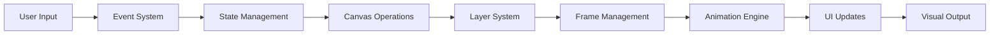
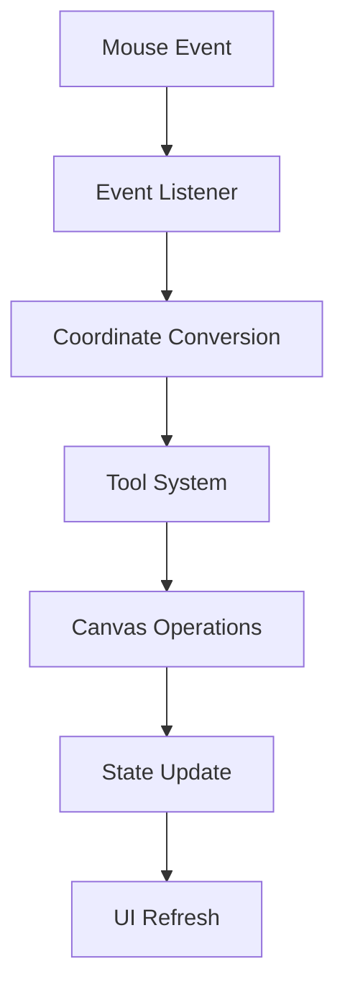
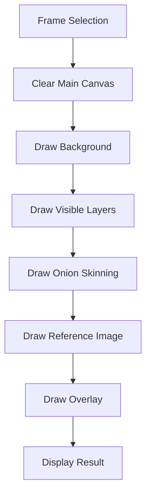
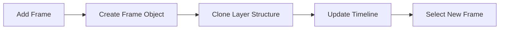
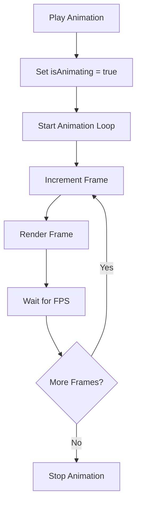
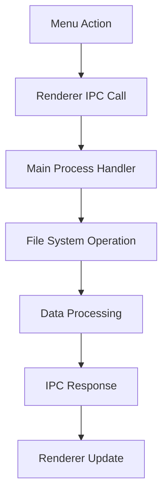
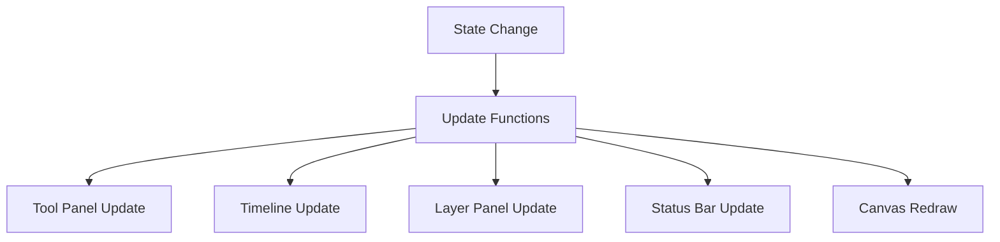

# Data Flow

## Overview

This document describes how data flows through the WASRTK application. For high-level architecture information, see [Architecture Overview](./overview.md).

## Data Flow Architecture

### High-Level Data Flow


## Input Data Flow

### User Input Processing


### Coordinate System Flow
```javascript
// Screen coordinates → Canvas coordinates
screenToCanvas(screenX, screenY) {
    const rect = mainCanvas.getBoundingClientRect();
    const canvasX = (screenX - rect.left) / zoom;
    const canvasY = (screenY - rect.top) / zoom;
    return this.roundToPixel(canvasX, canvasY);
}
```

## Tool System Data Flow

### Drawing Operation Flow
```mermaid
graph TD
    A[Mouse Down] --> B[startDrawing()]
    B --> C[Save State]
    C --> D[Initialize Stroke Canvas]
    D --> E[Mouse Move]
    E --> F[draw()]
    F --> G[Tool-Specific Operation]
    G --> H[Mouse Up]
    H --> I[stopDrawing()]
    I --> J[Commit to Layer]
    J --> K[Update UI]
```

### Tool-Specific Data Processing

#### Pen Tool Data Flow
```javascript
// Data flow: Mouse coordinates → Pixel drawing → Layer canvas
drawPoint(x, y, useStrokeCtx = false) {
    const ctx = useStrokeCtx ? strokeCtx : frame.layers[currentLayer].canvas.getContext('2d');
    ctx.fillStyle = currentColor;
    ctx.globalAlpha = currentOpacity;
    ctx.fillRect(x, y, brushSize, brushSize);
}
```

#### Line Tool Data Flow
```javascript
// Data flow: Start/End points → Line calculation → Preview → Commit
drawLine(x1, y1, x2, y2, useStrokeCtx = false) {
    const points = this.getLinePoints(x1, y1, x2, y2);
    points.forEach(point => this.drawPoint(point.x, point.y, useStrokeCtx));
}
```

## Canvas Data Flow

### Rendering Pipeline


### Layer Rendering Flow
```javascript
renderCurrentFrame() {
    // Clear main canvas
    mainCtx.clearRect(0, 0, mainCanvas.width, mainCanvas.height);
    
    // Draw background
    mainCtx.fillStyle = '#ffffff';
    mainCtx.fillRect(0, 0, mainCanvas.width, mainCanvas.height);
    
    // Draw visible layers
    const frame = frames[currentFrame];
    frame.layers.forEach(layer => {
        if (layer.visible) {
            mainCtx.drawImage(layer.canvas, 0, 0);
        }
    });
    
    // Draw onion skinning
    if (onionSkinningEnabled) {
        this.drawOnionSkinning();
    }
    
    // Draw reference image
    if (referenceImage && referenceVisible) {
        mainCtx.globalAlpha = referenceOpacity;
        mainCtx.drawImage(referenceImage, referenceX, referenceY, 
                         referenceImage.width * referenceScale, 
                         referenceImage.height * referenceScale);
        mainCtx.globalAlpha = 1.0;
    }
}
```

## Animation Data Flow

### Frame Management Flow


### Animation Playback Flow


## IPC Data Flow

### File Operations Flow


### Save Project Flow
```javascript
// Renderer → Main Process
async saveProject() {
    const projectData = {
        frames: frames.map(frame => ({
            id: frame.id,
            name: frame.name,
            layers: frame.layers.map(layer => ({
                id: layer.id,
                name: layer.name,
                visible: layer.visible,
                locked: layer.locked,
                imageData: layer.canvas.toDataURL()
            }))
        })),
        metadata: {
            version: '1.0.0',
            canvasWidth: mainCanvas.width,
            canvasHeight: mainCanvas.height,
            fps: fps
        }
    };
    
    const result = await window.electronAPI.saveFile(projectData);
    return result;
}
```

## State Synchronization Flow

### UI Update Flow


### State Update Functions
```javascript
updateUI() {
    updateToolPanel();
    updateTimeline();
    updateLayerPanel();
    updateStatusBar();
    updateBrushPreview();
}
```

This data flow architecture ensures efficient processing of user input, proper state management, and optimal rendering performance throughout the WASRTK application. 