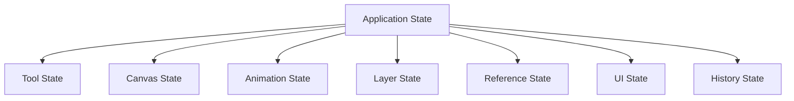

# State Management

## Overview

This document describes WASRTK's state management architecture. For high-level architecture information, see [Architecture Overview](./overview.md).

## State Architecture

### State Hierarchy


## Global State Structure

### Core State Variables
```javascript
// Tool State
let currentTool = 'pen';
let currentColor = '#000000';
let currentOpacity = 1.0;
let brushSize = 1;
let fillTolerance = 0;

// Canvas State
let zoom = 1;
let antialiasingEnabled = true;
let isDrawing = false;

// Animation State
let frames = [];
let currentFrame = 0;
let isAnimating = false;
let fps = 12;
let onionSkinningEnabled = false;

// Layer State
let layers = [];
let currentLayer = 0;

// Reference State
let referenceImage = null;
let referenceVisible = false;
let referenceOpacity = 0.5;
```

## Tool State Management

### Tool Selection State
```javascript
selectTool(tool) {
    currentTool = tool;
    
    // Update UI
    document.querySelectorAll('.tool-btn').forEach(btn => {
        btn.classList.remove('active');
    });
    document.querySelector(`[data-tool="${tool}"]`).classList.add('active');
    
    this.updateStatusBar();
}
```

### Brush State Management
```javascript
setBrushSize(size) {
    brushSize = size;
    document.getElementById('brushSizeValue').textContent = size + 'px';
    this.updateBrushPreview();
}

setColor(color) {
    currentColor = color;
    this.updateBrushPreview();
}

setOpacity(opacity) {
    currentOpacity = opacity / 100;
    this.updateBrushPreview();
}
```

## Animation State Management

### Frame State Management
```javascript
setCurrentFrame(frameIndex) {
    if (frameIndex >= 0 && frameIndex < frames.length) {
        currentFrame = frameIndex;
        this.renderCurrentFrame();
        this.updateTimeline();
    }
}

addFrame() {
    const newFrame = {
        id: frames.length,
        name: `Frame ${frames.length + 1}`,
        layers: this.cloneLayerStructure(),
        timestamp: Date.now()
    };
    frames.push(newFrame);
    this.setCurrentFrame(frames.length - 1);
}
```

### Animation Playback State
```javascript
playAnimation() {
    if (frames.length <= 1) return;
    
    isAnimating = true;
    const frameDelay = 1000 / fps;
    
    animationInterval = setInterval(() => {
        currentFrame = (currentFrame + 1) % frames.length;
        this.renderCurrentFrame();
        this.updateTimeline();
    }, frameDelay);
}

stopAnimation() {
    isAnimating = false;
    if (animationInterval) {
        clearInterval(animationInterval);
        animationInterval = null;
    }
}
```

## Layer State Management

### Layer Creation and Management
```javascript
addLayer(name = `Layer ${layers.length + 1}`) {
    const newLayer = {
        id: layers.length,
        name: name,
        visible: true,
        locked: false,
        canvas: this.createLayerCanvas()
    };
    
    layers.push(newLayer);
    
    // Add layer to all frames
    frames.forEach(frame => {
        frame.layers.push(this.cloneLayer(newLayer));
    });
    
    this.updateLayerPanel();
    this.renderCurrentFrame();
}

toggleLayerVisibility(layerIndex) {
    layers[layerIndex].visible = !layers[layerIndex].visible;
    
    // Update visibility in all frames
    frames.forEach(frame => {
        frame.layers[layerIndex].visible = layers[layerIndex].visible;
    });
    
    this.updateLayerPanel();
    this.renderCurrentFrame();
}
```

## History State Management

### Undo/Redo System
```javascript
class HistoryManager {
    constructor() {
        this.undoStack = [];
        this.redoStack = [];
        this.maxHistorySize = 50;
    }
    
    saveState() {
        const state = {
            frames: this.cloneFrames(frames),
            currentFrame: currentFrame,
            currentLayer: currentLayer,
            timestamp: Date.now()
        };
        
        this.undoStack.push(state);
        
        if (this.undoStack.length > this.maxHistorySize) {
            this.undoStack.shift();
        }
        
        this.redoStack = [];
    }
    
    undo() {
        if (this.undoStack.length > 0) {
            const currentState = {
                frames: this.cloneFrames(frames),
                currentFrame: currentFrame,
                currentLayer: currentLayer,
                timestamp: Date.now()
            };
            
            this.redoStack.push(currentState);
            const previousState = this.undoStack.pop();
            this.restoreState(previousState);
        }
    }
    
    restoreState(state) {
        frames = state.frames;
        currentFrame = state.currentFrame;
        currentLayer = state.currentLayer;
        
        this.renderCurrentFrame();
        this.updateUI();
    }
}
```

## UI State Management

### Status Bar Updates
```javascript
updateStatusBar() {
    const statusBar = document.getElementById('statusBar');
    
    const toolInfo = `Tool: ${currentTool.charAt(0).toUpperCase() + currentTool.slice(1)}`;
    const brushInfo = `Brush: ${brushSize}px`;
    const colorInfo = `Color: ${currentColor}`;
    const frameInfo = `Frame: ${currentFrame + 1}/${frames.length}`;
    const layerInfo = `Layer: ${layers[currentLayer]?.name || 'None'}`;
    const zoomInfo = `Zoom: ${Math.round(zoom * 100)}%`;
    
    statusBar.textContent = `${toolInfo} | ${brushInfo} | ${colorInfo} | ${frameInfo} | ${layerInfo} | ${zoomInfo}`;
}
```

### Panel State Updates
```javascript
updateUI() {
    updateToolPanel();
    updateTimeline();
    updateLayerPanel();
    updateStatusBar();
    updateBrushPreview();
}
```

## State Persistence

### Project State Serialization
```javascript
serializeProjectState() {
    return {
        frames: frames.map(frame => ({
            id: frame.id,
            name: frame.name,
            layers: frame.layers.map(layer => ({
                id: layer.id,
                name: layer.name,
                visible: layer.visible,
                locked: layer.locked,
                imageData: layer.canvas.toDataURL()
            })),
            timestamp: frame.timestamp
        })),
        metadata: {
            version: '1.0.0',
            canvasWidth: mainCanvas.width,
            canvasHeight: mainCanvas.height,
            fps: fps,
            currentFrame: currentFrame,
            currentLayer: currentLayer,
            currentTool: currentTool,
            currentColor: currentColor,
            brushSize: brushSize,
            opacity: currentOpacity,
            zoom: zoom
        }
    };
}
```

This state management architecture provides a robust foundation for maintaining application consistency and supporting undo/redo operations. 